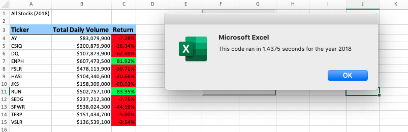

# stock-analysis
Performing analysis on stocks to uncover trends

## Overview of Project
My good friend Steve has asked me to help him analyze a handfull of green energy stocks in effort to help his parents diversify their portfolio. He has given me an excel file containing all the stock data he'd like me to analyze. I am going to utilize VBA to automate this task. Utilizing VBA code to automate analyses will allow Steve to reuse it for any stock and reduces the chances of accidents and errors.

### Purpose
The purpose of this task is to create a code that will automate stock analyses. The 2nd purpose of this task is to create a refactored version of this code with the intent of utilization on a lerger scale.
## Results

### Analysis of Outcomes Based on Stock Performance
The code created 3 columns of outputed data, The stocks' tickers, The stock's total daily volume, and stock's return. The ticker is a unique identifier for each stock, the total daily volume is the daily amount of shares trades within a given stock, and the return represents how well a stock performs. In the code created, positive returns are formatted to the color green and negative returns are formatted to the color red.

In the chart below we can see that, aside from TERP, all of the stocks exhibited postive returns during 2017. Terp had a -7.2% return and is highlighted in red.

If you held any of stocks that are highlighted green, you would've made some money in 2017. While having shares in those stocks are good for 2017, there is a big difference in returns for 2018. The only 2 stocks to have positive returns in 2018 were ENPH and RUN, which are highlighted in green. Those are the only two stocks that would be profitable if oyu hald them for both 2017 and 2018.

## Summary

The advantage biggest advantage of refactoring our code was to see it run fastor. While this is an obvious advantage, there are others as well. Refactored code is easier to maintain when it comes to making adjustments. It helps identifying coding bugs easier, and makes the overall code more short and succicnt. For my case, one of the cons of refactoring the code was trying the understand the changes that were being made, from a logical standpoint. Some of these difficulties came when rewriting loops utilizing variables as indexes. We saw in the refactored script that the code ran quicker than our original script. This will prove to be very useful when handling a lot more stocks. When re have a dataset with all of these additional stocks, the refactored code will have a lot less adjustments that will need to be made.
