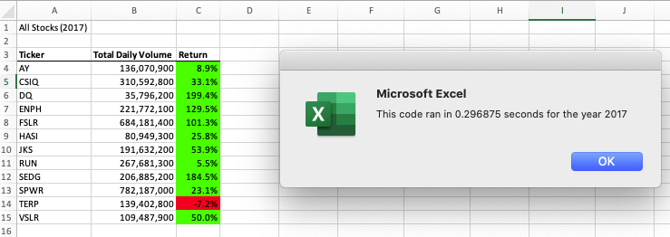
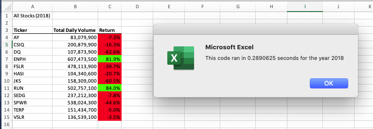
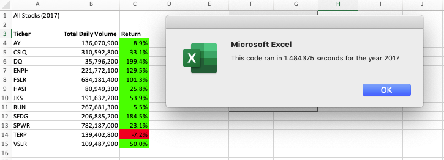

# stock-analysis
Performing analysis on stocks to uncover trends

## Overview of Project
My good friend Steve has asked me to help him analyze a handfull of green energy stocks in effort to help his parents diversify their portfolio. He has given me an excel file containing all the stock data he'd like me to analyze. I am going to utilize VBA to automate this task. Utilizing VBA code to automate analyses will allow Steve to reuse it for any stock and reduces the chances of accidents and errors.

### Purpose
The purpose of this task is to create a code that will automate stock analyses. The 2nd purpose of this task is to create a refactored version of this code with the intent of utilization on a lerger scale.
## Results

### Analysis of Outcomes Based on Stock Performance
The code created 3 columns of outputed data, The stocks' tickers, The stock's total daily volume, and stock's return. The ticker is a unique identifier for each stock, the total daily volume is the daily amount of shares trades within a given stock, and the return represents how well a stock performs. In the code created, positive returns are formatted to the color green and negative returns are formatted to the color red.

In the chart below we can see that, aside from TERP, all of the stocks exhibited postive returns during 2017. Terp had a -7.2% return and is highlighted in red.

If you held any of stocks that are highlighted green, you would've made some money in 2017. While having shares in those stocks are good for 2017, there is a big difference in returns for 2018. The only 2 stocks to have positive returns in 2018 were ENPH and RUN, which are highlighted in green. Those are the only two stocks that would be profitable if oyu hald them for both 2017 and 2018.

Prior to refactoring the code, these scripts ran relatively slower. While the difference of a 1.2 seconds may not be too much for the run time, there are other advantages that we may encounter in the long run. While the output only shows the time difference, the code itself has ab improved deisgn and structure. The improved design helps a lot when trying to make adjustments to the code becuase it will be easier to read. The stucture has improved and will prove to be very useful when debugging the code

## Summary

To rediterate, the advantages of refactoring code is to see a faster run time, and to have a better code design & structure. While refactored code is quicker to run, the actual process of refactoring the code takes a lot of time to do, which isnt good if you are on a strict deadline. I faced this challenge when trying to understand the changes that were being made, from a logical standpoint. Some of these difficulties came when rewriting loops utilizing variables as indexes and calling on arrays using variables as indexes. The pros and cons of refactoring this code were wintessed first hand. The logic of the original script was easier to grasp but the code was more "step by step" which makes the code less aesthetic and harder to read. It proably took me twice the amount of time to refactor the original script, just to make sure all of the logic was correct. I believe that this refactored code will prove to be most useful when we have a dataset with all of many stocks across different markets.
